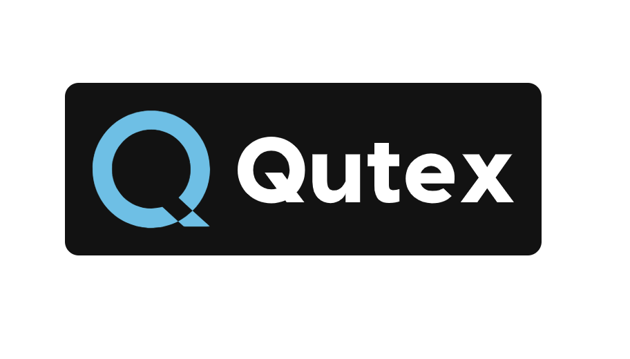

    

 

Qutex is a basic webex queue management system which can be used to manage a resource between many people in a common webex space or web UI.

Simply add Qutex (qutex@webex.bot) to a room or direct message it! You can use the "help" command to give you some info about what Qutex can do!

