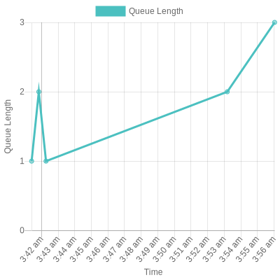

# Analytics

## Graphs

## Queue Length History



You can use Qutex to generate some basic graphs that show statistical trends in the data that is collected by Qutex. One such graph is the graph of Queue Length over time. Qutex will also respond a link by which you can view your chart in a browser or download the chart. You can get this graph by invoking the following command:

=== "Generic"
    ```
    get queue length history
    ```
=== "Regex"
    ```
    ^\s*get queue length history\s*$
    ```

???+ example
    

???+ note
    To get these graphs, Qutex leverages [QuickChart](https://quickchart.io/) to build and generate the graphs. No personal data is sent here. See the [Qutex Privacy Policy](https://github.com/amthorn/qutex/wiki/Privacy-Policy) for more information.