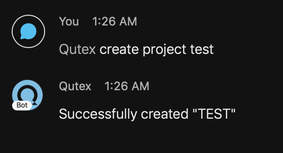

<figure>
  
</figure>

# Welcome to the Qutex Documentation Page!

## Introduction

Qutex is a basic Queue Management System that was designed as a Cisco Webex bot. The primary goal was to provide a system,
interactable within Cisco Webex, that can be used to manage shared resources or any other task where a queue might be helpful.
It can be used to manage who is using a particular resource or it can be used to track whose turn it is to perform a
particular task, such as doing Agile retrospectives or restocking the refridgerator.

Written in typescript, containerized via docker-compose, and hosted in AWS, it has been designed from the ground up to serve
this one particular function.

## Current Status

### Activity

### Test Coverage

## Getting Started

In Qutex, simply add `qutex@webex.bot` to any room or you can send a direct message. Once you have done that, you will
need to [create a project](./projects/#creating-a-new-project). A Qutex Project is essentially a "bucket" for [Qutex Queues](./queues).
You can create a qutex project with the command:

`create project <project_name>`

Where `<project_name>` is replaced with the name of the project you want to create.

???+ warning
    Project names must be unique in qutex. Thus, you cannot create a project with a name that already exists. Additionally, the name of the project can only contain lowercase and uppercase alphabetical characters, spaces, and the underscore.

???+ note
    Your project will automatically be put in uppercase regardless of how it was entered

???+ example
    

???+ note
    Whenever you are in a room, you must tag Qutex before the command in order for Qutex to respond.

When you issue the `create project` command, Qutex will create a project for you with a [default queue](./queues/#what-is-the-default-queue) (named "DEFAULT"), it will [register your location](./registrations) to the newly created project, and it will [assign you as an admin](./administration) of the project.

Now you can begin using Qutex with the [add me](./queues/#adding-myself-into-a-queue) or [add person](./queues/#adding-others-into-a-queue) command!

If you have any questions, you can use the [`help` command](./troubleshooting/#help-command).