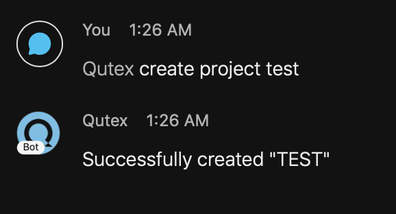

# Projects

## What is a Project?

A project is essentially a collection of [queues](../queues). Only one queue within a project can be set as the [current queue](../queues/#what-is-the-current-queue). Additionally, a project contains [administrators](../administration) who are responsible for administrating the project.

## Creating a New Project



You can create a qutex project with the command:

=== "Generic"
    ```
    create project <project_name>
    ```
=== "Valid Example"
    ```
    create project valid
    ```
=== "Invalid Example"
    ```
    create project NOT&^%VALID
    ```
=== "Regex"
    ```
    ^\s*create project [\w\s]+\s*$
    ```

???+ important
    You cannot create a project if the location you are in already has a project registered.

???+ warning
    Project names must be unique in qutex. Thus, you cannot create a project with a name that already exists. Additionally, the name of the project can only contain lowercase and uppercase alphabetical characters, spaces, and the underscore.

???+ note
    Your project will automatically be put in uppercase regardless of how it was entered

???+ example
    

???+ note
    Whenever you are in a room, you must tag Qutex before the command in order for Qutex to respond.

When you issue the `create project` command, Qutex will create a project for you with a [default queue](../queues/#what-is-the-default-queue) (named "DEFAULT"), it will [register your location](../registrations) to the newly created project, and it will [assign you as an admin](../administration) of the project.


???+ success
    You can verify your project was created by issueing the [`list projects` command](#listing-all-projects)

## Modifying A Project Name

Unfortunately, modifying the name of an existing project is not currently possible with Qutex. You would need to [delete the project](#deleting-a-project) and [create a new one](#creating-a-new-project) with the new name.

## Deleting A Project



You can delete a qutex project with the following command:

=== "Generic"
    ```
    delete project <project_name>
    ```
=== "Valid Example"
    ```
    delete project valid
    ```
=== "Invalid Example"
    ```
    delete project NOT&^%VALID
    ```
=== "Regex"
    ```
    ^\s*(delete|remove) project [\w\s]+\s*$
    ```

???+ warning
    Deleting a project is not reversible. The data will be permanantly deleted.

???+ warning
    When a project is deleted, all corresponding registrations for all destinations will also be deleted.

???+ success
    You can verify your project was deleted by issuing the [`list projects` command](#listing-all-projects)

## Listing All Projects



Listing all projects that you have access to is possible with qutex by issuing the following command:

=== "Generic"
    ```
    list projects
    ```
=== "Regex"
    ```
    ^\s*list projects\s*$
    ```

???+ note
    The only projects that will show up are projects that you have access to. This is determined by the projects on which you are a [project administrator](/authorization/#project-administrators). Your projects will not show up for others and you will not see others' projects.